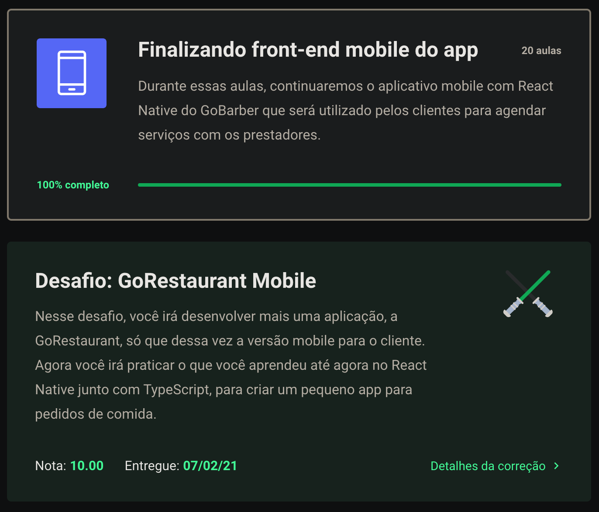
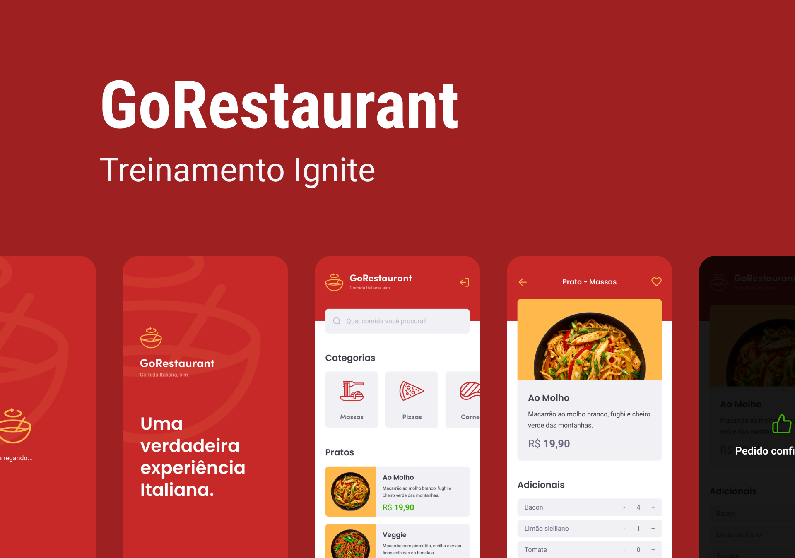

 <div align="center" id="top">
  <p align="center">
  	
  </p>
</div>

 <hr/>

  <h1 align="center"> Go Restaurant Mobile </h1>

<p align="center">
   
   
   
   
   
	
</p>	

<p align="center">
  <a href="#dart-sobre"> Sobre </a> &#xa0; | &#xa0; 
  <a href="#rocket-tecnologias"> Tecnologias </a> &#xa0; | &#xa0;
  <a href="#white_check_mark-requisitos"> Requisitos </a> &#xa0; | &#xa0;
  <a href="#checkered_flag-iniciando"> Iniciando </a> &#xa0; | &#xa0;
  <a href="#unlock-licença"> Licença </a> &#xa0; | &#xa0;
  <a href="https://www.linkedin.com/in/luiza-lissandra/" target="_blank"> Desenvolvedora </a>
</p>

<br>

## :dart: Sobre ##

<p align="center">
	
</p>

<br>

Este projeto é resultado do meu décimo desafio de código no <a href="https://rocketseat.com.br/gostack">bootcamp Go Stack da Rocketseat. </a> Nele fui desafiada a colocar em prática tudo que aprendi sobre React Native junto com TypeScript através da aplicação GoRestaurant.



## :rocket: Tecnologias ##

As seguintes tecnologias foram utilizadas nesse projeto:

- [React Native](https://reactnative.dev/)
- [Typescript](https://www.typescriptlang.org/)
- [API](https://canaltech.com.br/software/o-que-e-api/#:~:text=API%20%C3%A9%20um%20conjunto%20de,Interface%20de%20Programa%C3%A7%C3%A3o%20de%20Aplicativos%22.)

## :white_check_mark: Requisitos ##

Antes de começar :checkered_flag:, você precisa ter o [Git](https://git-scm.com) e o [Node](https://nodejs.org/en/) instalados.

## :checkered_flag: Iniciando ##

```bash
# Clone este projeto:
$ git clone https://github.com/LissandraRodrigues/go-restaurant-mobile

# O acesse:
$ cd go-restaurant-mobile

# Instale as dependências:
$ yarn 

# Execute a API fake:
$ yarn json-server server.json -p 3333 

# Se você for usar emulador iOS XCode, entre na pasta ios e digite o seguinte comando para instalar todas as dependências iOS:
$ pod install 

# Para executar o emulador iOS:
$ yarn ios

# Para executar no emulador Android:
$ yarn android

```

## :unlock: Licença ##

Este projeto está sob a licença do MIT. Para saber mais, veja em [LICENSE](LICENSE).

<hr/>

Feito por <a href="https://www.linkedin.com/in/luiza-lissandra/" target="_blank"> Luiza Lissandra :rocket: </a>

&#xa0;

<a href="#top"> Voltar para o início </a>
